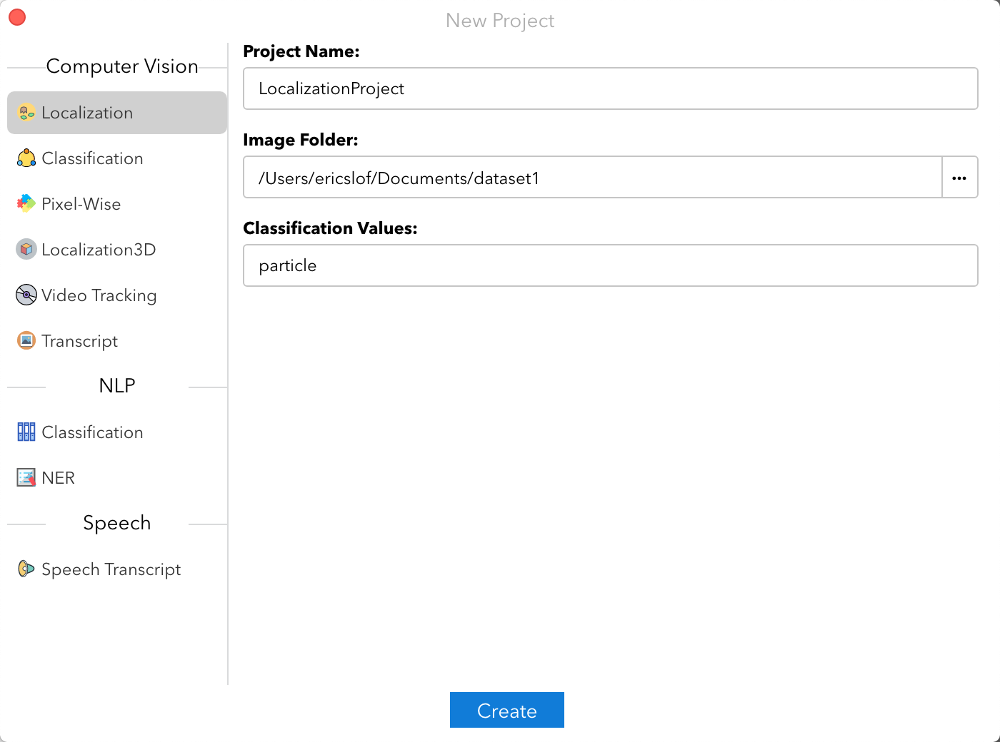
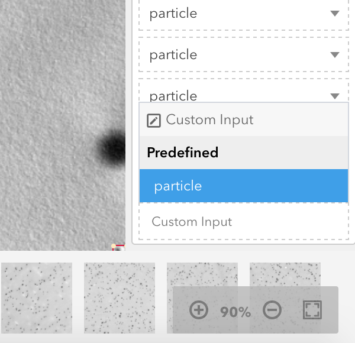

## Particle Labeling

This is the repo for particle labeling.

### Guide

1. Please download "[Colabeler](colabeler.com)" at the website and install.

2. Download the image and its ".json" file from "/ToBeLabeled".

3. Download "tool.py" and put it in the ".json" folder. Run it and change ".json" file to the current path.

4. Open Colabeler and chose "New Project". Choose localization project. Set Image Folder to the right one and Classification Values to "particle".

   

5. When loading is completed, click "Import" and set to the ".json" file folder. Waiting for it to import.

6. The image is pre-labeled by the current demo network. The possible errors are, missing particles, merging multiple particles, labeling the blank areas, etc. Press "r" to add a new rectangle box. After adding the first box, please find the new one in the label list and change the category to "predefined - particle". Then, every box after that would be automatically changed to particle category.

   

7. During labeling, remember to save using the blue check-mark in the bottom.

8. When finishing one image, save and click "Next" in the tool bar on the left of screen.

9. When done labeling, click "Export" and choose "JSON". Commit the .json files to this repo. Thanks.

